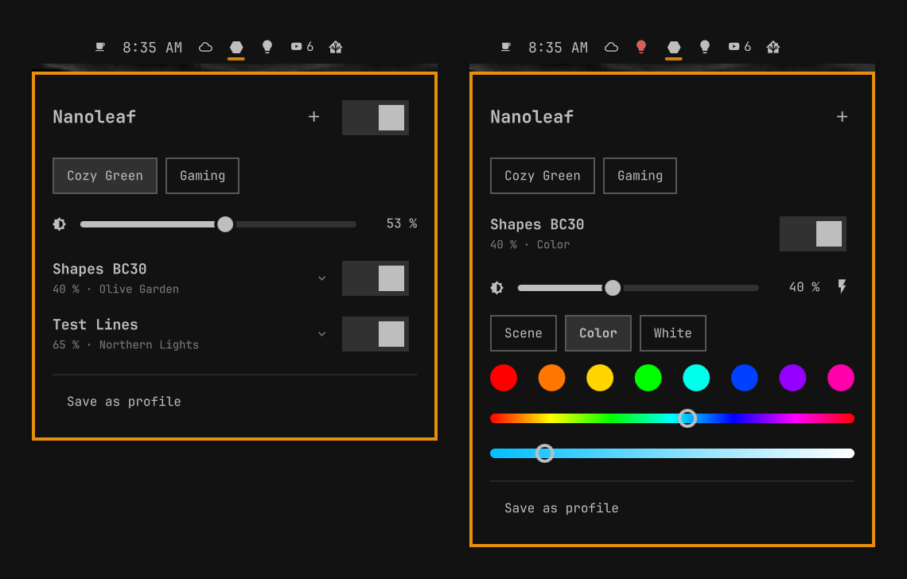
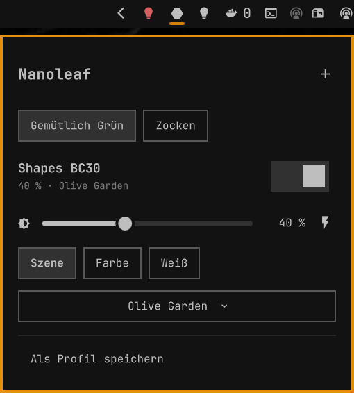
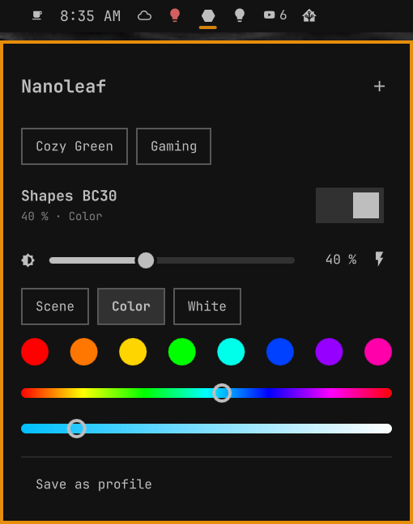
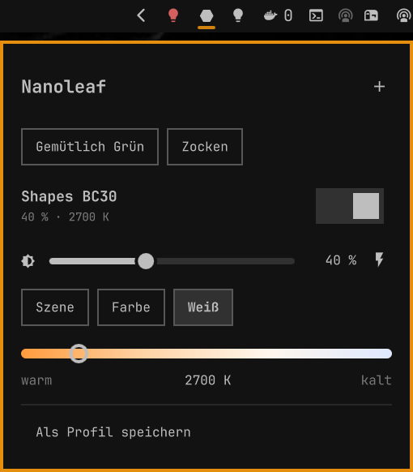

# Omarchy Light Control for Nanoleafs

[](https://github.com/mahype/omarchy-light-control-nanoleafs/actions/workflows/ci.yml)
[](https://github.com/mahype/omarchy-light-control-nanoleafs/actions/workflows/ci.yml)
[](#tests)
[](#tests)
[](#tests)
[](LICENSE)
[](https://omarchy.org)
[](https://nanoleaf.me)
[](#privacy-and-security)
[](#requirements)

Control your Nanoleaf light panels from the Omarchy bar. The plugin talks
directly to the devices over the local Nanoleaf Open API, with no cloud and no
account.



## Features

- **Bar icon:** a hexagon tile, filled while any light is on. Left click opens
  the panel, right click toggles all lights, and scrolling changes the
  brightness of all lights that are on.
- **Per device:** on/off, brightness and "Flash device" (identify). Each
  device has three modes, and only one is active at a time:
  - **Scene:** the scenes stored on the device (created in the Nanoleaf app)
  - **Color:** color presets plus hue and saturation sliders
  - **White:** white tone from warm to cool
- **Profiles:** "Save as profile" saves the current state of the devices
  you select, so rooms can have their own profiles. Profiles show up as buttons
  at the top, and the active one is highlighted. Right click a profile to
  delete it. Saving under an existing name overwrites it.
- **Discovery and pairing:** devices are found automatically via mDNS, and
  paired devices that get a new IP address are followed.
- **Lean UI:** only the essentials are visible; per-device controls fold out
  on click.

- **English and German:** the UI follows the system language and uses the
  Nanoleaf app's wording. You can also pick the language in the widget
  settings.

| Scene | Color | White |
|---|---|---|
|  |  |  |

## Supported devices

Shapes, Canvas, Lines, Elements, Light Panels, 4D/Skylight: anything that
speaks the Nanoleaf Open API.

Not supported: **Nanoleaf Essentials** bulbs and strips. They use
Matter/Thread and have no Open API.

## Requirements

- Omarchy 4 or newer
- `avahi` with a running `avahi-daemon` for discovery (part of Omarchy)

There are no other runtime dependencies, and nothing is bundled or downloaded.

## Installation

```bash
omarchy plugin add https://github.com/mahype/omarchy-light-control-nanoleafs.git --enable
```

Then pair your device:

1. Click the hexagon in the bar and then `+` to search the network.
2. Hold the power button on the Nanoleaf controller for 5–7 seconds until the
   LEDs flash.
3. Within 30 seconds, click "Pair" next to the device.

To update later, run `omarchy plugin update io.github.mahype.omarchy-light-control-nanoleafs`.

## Removal

```bash
omarchy plugin remove io.github.mahype.omarchy-light-control-nanoleafs
rm -rf ~/.config/omarchy/nanoleaf   # paired devices, tokens and profiles
```

## Privacy and security

- All traffic stays in your local network. The plugin only talks to the
  Nanoleaf devices you pair, over the Open API on port 16021.
- Device tokens and profiles are stored in
  `~/.config/omarchy/nanoleaf/config.json`. The directory is created with mode
  0700.
- The only external programs it runs are `avahi-browse` (discovery) and
  `install` (to create the config directory). Both are called with argument
  arrays, never through a shell.
- No installer, no sudo, no services, no downloads.

## Development

| File | Purpose |
|---|---|
| `Service.qml` | Owns config, device state and all HTTP traffic |
| `NanoleafApi.js` | Nanoleaf Open API requests and response parsing |
| `ConfigStore.js` | Config normalization and serialization |
| `Profiles.js` | Profile capture, matching and normalization |
| `I18n.js` | English and German UI strings |
| `Pending.js` | Keeps optimistic switch states from being undone by stale reads |
| `Panel.qml` | Bar icon and popup |
| `tools/fake-nanoleaf.py` | Simulated Nanoleaf device for testing without hardware |
| `tests/` | Unit tests, fake-device test, QML lint, manifest check |

Run all checks (Node 22+, Python 3, jq; `qmllint` from `qt6-declarative` for the QML lint):

```bash
bash tests/run-all.sh
```

## Tests

Every push runs these checks in CI, and the badges at the top show their
results:

- **Tests:** unit tests for the JavaScript modules (discovery parsing, device
  state, modes, profiles, config, translations, the HTTP layer against a
  scripted `XMLHttpRequest`) plus an end-to-end test of the simulated device.
- **Coverage:** line coverage of the JavaScript modules (`NanoleafApi.js`,
  `Profiles.js`, `ConfigStore.js`, `I18n.js`, `Pending.js`). CI fails below 95 % lines,
  95 % functions or 80 % branches. The QML files are covered by the QML lint,
  not by the coverage number.
- **QML lint:** `qmllint` on the QML files, failing on real defects such as a
  property or id that shadows a Qt built-in. A deliberately broken fixture
  (`tests/fixtures/ShadowedPalette.qml`) proves the lint catches them.
- **Manifest:** the rules of `omarchy plugin validate` and the marketplace.

Link a checkout into Omarchy:

```bash
ln -s "$PWD" ~/.config/omarchy/plugins/io.github.mahype.omarchy-light-control-nanoleafs
omarchy-shell shell rescanPlugins
omarchy plugin enable io.github.mahype.omarchy-light-control-nanoleafs
```

Omarchy's file watcher does not follow symlinks, so run
`omarchy restart shell` after changing code.

To try several devices without extra hardware, start simulated ones. They
show up in the panel's discovery and pair without a button press:

```bash
tools/fake-nanoleaf.py --name "Test Lines"
tools/fake-nanoleaf.py --name "Office Canvas" --port 16031 --id FA:KE:00:00:00:02
```

## Roadmap

- Settings overlay (rename, forget devices, manage profiles)
- Live updates via the Open API event stream instead of polling

## License

MIT, see [LICENSE](LICENSE). Nanoleaf is a trademark of Nanoleaf Energy
Technology; this project is not affiliated with or endorsed by Nanoleaf.
